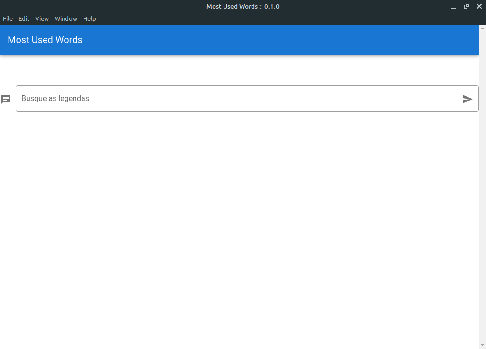

# MostUsedWords



:books: Project developed for the purpose of learning Electron and Vuejs technology, made in a practical course of the Cod3r programming platform.

  - finds the most common words in a caption


### Tech :computer:
* [Vuejs] - HTML enhanced for web apps and electron application!
* [electron] - engine for desktop application.
* [Twitter Bootstrap] - great UI boilerplate for modern web apps
* [node.js] - evented I/O for the backend
* [eslint] - tool to keep code readable

### Installation

MostUsedWords requires [Node.js](https://nodejs.org/) v4+ to run.


## Project setup
```
npm install
```

### Compiles and hot-reloads for development
```
npm run electron:serve
```

### Compiles and minifies for production
```
npm run electron:build
```

### Lints and fixes files
```
npm run lint
```

### Customize configuration
See [Configuration Reference](https://cli.vuejs.org/config/).


### Development

Want to contribute? Great!


License
----

MIT


[node.js]: <http://nodejs.org>
[Vuejs]: <https://vuejs.org>
[electron]: <https://www.electronjs.org>
[Twitter Bootstrap]: <https://getbootstrap.com>
[eslint]: <https://eslint.org>
